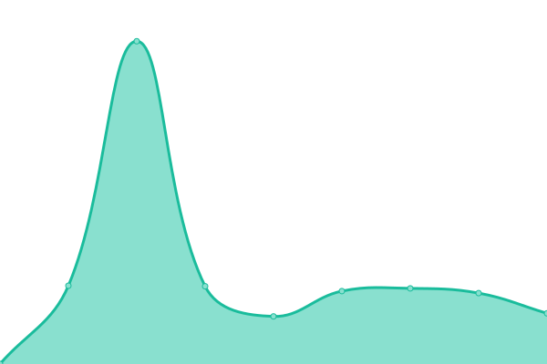

# [📈 Live Status](https://dylan-da.github.io/ayoba-microapp-uptime-monitor): <!--live status--> **🟩 All systems operational**

This repository contains the open-source uptime monitor and status page for [dylan-da](https://dylan-da.github.io/ayoba-microapp-uptime-monitor), powered by [Upptime](https://github.com/upptime/upptime).

With [Upptime](https://upptime.js.org), you can get your own unlimited and free uptime monitor and status page, powered entirely by a GitHub repository. We use [Issues](https://github.com/dylan-da/ayoba-microapp-uptime-monitor/issues) as incident reports, [Actions](https://github.com/dylan-da/ayoba-microapp-uptime-monitor/actions) as uptime monitors, and [Pages](https://dylan-da.github.io/ayoba-microapp-uptime-monitor) for the status page.

<!--start: status pages-->
<!-- This summary is generated by Upptime (https://github.com/upptime/upptime) -->
<!-- Do not edit this manually, your changes will be overwritten -->
<!-- prettier-ignore -->
| URL | Status | History | Response Time | Uptime |
| --- | ------ | ------- | ------------- | ------ |
|  [Survey54](https://survey54.com/open-surveys) | 🟩 Up | [survey54.yml](https://github.com/dylan-da/ayoba-microapp-uptime-monitor/commits/HEAD/history/survey54.yml) | 

 475ms
     
 | 

<a href="https://dylan-da.github.io/ayoba-microapp-uptime-monitor/history/survey54">100.00%</a>
    

|  [Guardian Health](https://guardianhealth.io/) | 🟩 Up | [guardian-health.yml](https://github.com/dylan-da/ayoba-microapp-uptime-monitor/commits/HEAD/history/guardian-health.yml) | 

 243ms
     
 | 

<a href="https://dylan-da.github.io/ayoba-microapp-uptime-monitor/history/guardian-health">100.00%</a>
    

|  [Samestart](https://www.samestart.com/) | 🟩 Up | [samestart.yml](https://github.com/dylan-da/ayoba-microapp-uptime-monitor/commits/HEAD/history/samestart.yml) | 

 168ms
     
 | 

<a href="https://dylan-da.github.io/ayoba-microapp-uptime-monitor/history/samestart">32.24%</a>
    

|  [playboxcade](https://playboxcade.com/) | 🟩 Up | [playboxcade.yml](https://github.com/dylan-da/ayoba-microapp-uptime-monitor/commits/HEAD/history/playboxcade.yml) | 

 1109ms
     
 | 

<a href="https://dylan-da.github.io/ayoba-microapp-uptime-monitor/history/playboxcade">100.00%</a>
    

|  [Firework](https://fw.tv/ayoba_africa) | 🟩 Up | [firework.yml](https://github.com/dylan-da/ayoba-microapp-uptime-monitor/commits/HEAD/history/firework.yml) | 

 960ms
     
 | 

<a href="https://dylan-da.github.io/ayoba-microapp-uptime-monitor/history/firework">100.00%</a>
    

|  [Miss Côte d Ivoire 2021](https://www.mtn.ci/miss-ci/) | 🟩 Up | [miss-cote-d-ivoire-2021.yml](https://github.com/dylan-da/ayoba-microapp-uptime-monitor/commits/HEAD/history/miss-cote-d-ivoire-2021.yml) | 

 2829ms
     
 | 

<a href="https://dylan-da.github.io/ayoba-microapp-uptime-monitor/history/miss-cote-d-ivoire-2021">99.33%</a>
    

|  [Live Masjid](https://www.livemasjid.com/) | 🟩 Up | [live-masjid.yml](https://github.com/dylan-da/ayoba-microapp-uptime-monitor/commits/HEAD/history/live-masjid.yml) | 

 298ms
     
 | 

<a href="https://dylan-da.github.io/ayoba-microapp-uptime-monitor/history/live-masjid">100.00%</a>
    

<!--end: status pages-->

[**Visit our status website →**](https://dylan-da.github.io/ayoba-microapp-uptime-monitor)

## 📄 License

- Powered by: [Upptime](https://github.com/upptime/upptime)
- Code: [MIT](./LICENSE) © [dylan-da](https://dylan-da.github.io/ayoba-microapp-uptime-monitor)
- Data in the `./history` directory: [Open Database License](https://opendatacommons.org/licenses/odbl/1-0/)
